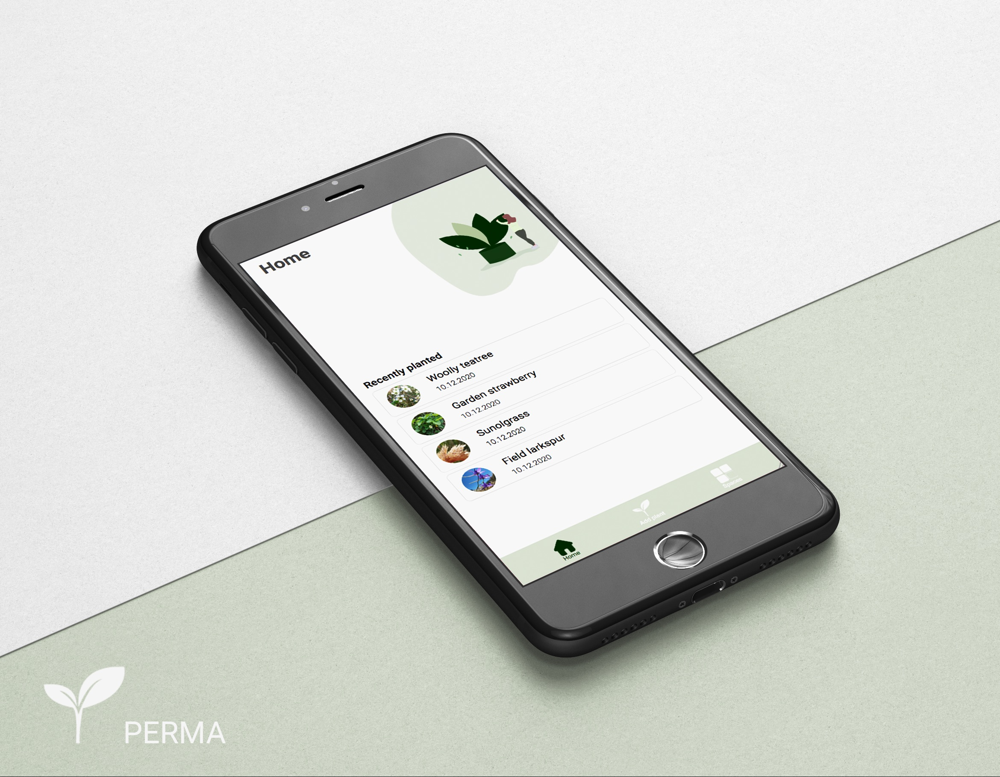

# Perma - the next gardening app

## Intro

Derived from the principle of `Permaculture`, the app will help you plan your garden. Search for plants and their characteristics in sowing, row spacing, necessary soil texture and many more. Add your plants to a virtual patch and stay up to date on harvesting with an integrated harvest-calender.

## Design

## Technologies

- React
- Express.js
- JEST 
- Cypress
- Styleguidist

**API reference** 

All plants data displayed in the app is requested from the freely accessible botanical data source and REST API [Trefle](https://trefle.io/).

## Heroku deployment

https://perma-app.herokuapp.com

## Install

Fork the repository and run `$ npm install` to install all dependencies.

### **Client**

`$ npm start`

Open [http://localhost:3000](http://localhost:3000) to view it in the browser.

### **Server**

`$ mv .env.example .env` 

Setup an account with [Trefle](https://trefle.io/) and add your API_KEY.

`$ npm run server` 

Open [http://localhost:3001](http://localhost:3001) to view it in the browser.

## License
[MIT](https://en.wikipedia.org/wiki/MIT_License#License_terms) 
